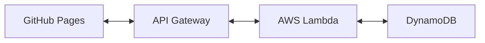

# **SiteWatcher プロジェクト概要**

## **プロジェクト名**
SiteWatcher

## **目的**
1. 自分専用のポータルページを作成し、よく見るページに素早くアクセスできるようにする。
2. Webアプリケーション開発やAWSを活用する実践的な学習を行う。
3. 作成したサイトやその開発記録をポートフォリオとして公開し、自身の技術力をアピールする。

## **主要機能**
- ユーザーがブックマークとして複数のURLを登録し、それを表示する。
- 登録したURLの最終アクセス日時を保存し、表示する。
- 登録したURLの最終更新日をチェックし、更新されている場合は通知する。
- GitHub Pagesでホスティングし、シンプルなWebインターフェースを提供する。

---

# **システム構成**

## **1. フロントエンド**
- **役割:**  
  ユーザーがURLを登録・表示・管理するためのインターフェースを提供する。

- **技術:**  
  - 初期構成はHTML, CSS, JavaScriptのシンプルな構成。
  - ホスティングはGitHub Pagesを使用。

- **将来的な拡張:**  
  - ReactやVue.jsなどのフレームワークを導入して、動的なUIを実現。

---

## **2. バックエンド**
- **役割:**  
  データの保存、処理、提供を行う。

- **技術:**  
  - AWS Lambdaでサーバーレス構成を実現。
  - データはDynamoDBに保存し、URLや最終アクセス日時を管理する。
  - API Gatewayでフロントエンドとバックエンドの連携を行う。

- **構成図:**  

---

## **3. CI/CD**
- **役割:**  
  開発とデプロイの効率化、自動化。

- **技術:**  
  - GitHub Actionsを使用。
  - フロントエンドのビルド・デプロイをGitHub Pagesに自動デプロイ。
  - バックエンドのデプロイをAWS CLI経由で自動化。

---

# **今後の流れ**
1. **フロントエンド構築:** シンプルなUIでスタート。ユーザーの使いやすさを重視。
2. **バックエンド構築:** AWSサービスを活用し、サーバーレス構成を設計。
3. **CI/CDの設定:** GitHub Actionsでフロントエンド・バックエンドのデプロイを自動化。
4. **機能拡張:** 必要に応じてフレームワーク導入や新機能追加を検討。

---

# **参考情報**
- **学習用リソース:**  
  - [AWS公式ドキュメント](https://aws.amazon.com/documentation/)  
  - [GitHub Actions公式ガイド](https://docs.github.com/en/actions)  
  - [DynamoDBのデータ設計ガイド](https://docs.aws.amazon.com/amazondynamodb/latest/developerguide/best-practices.html)

